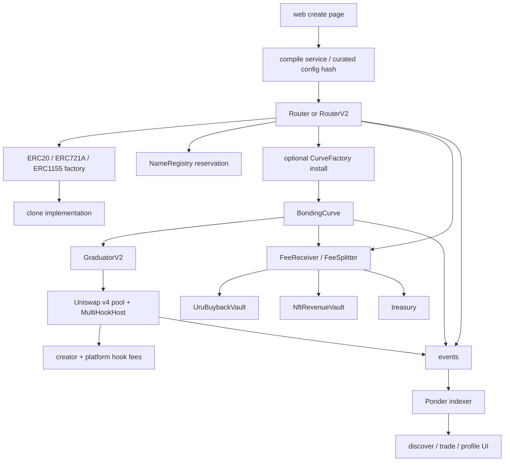

# Code Walkthrough and Change Guide

This guide is for reading `urufu-launchpad` from the bottom up: what each
piece does, how a launch moves through the system, and which areas should be
changed first before opening the launchpad to real users.

The short version: this is a real Robinhood-chain token launchpad with a
contract deploy path, bonding-curve trading, Uniswap v4 graduation, and v4
hook features that can protect and monetize launched tokens. The URU / urufu
gemu flywheel is useful platform economics, but the main product draw is the v4
integration. The main risk is not that the repo is fake. The main risk is that
the shipped product is narrower, more gated, and more operationally fragile
than the broad README story currently implies.

## Mental Model

There are four loops in the system:

1. A deployer creates a token.
2. Traders buy and sell it on a bonding curve.
3. Successful curves graduate into Uniswap v4 with locked liquidity and hook
   behavior.
4. Hook fees and, later, platform fee routing can feed the URU / gemu flywheel.



The codebase is a pnpm workspace:

- `contracts/` is the Solidity protocol.
- `web/` is the Next app.
- `compile-service/` validates compositions, serves whitelist / metadata /
  rewards helpers, and runs keeper jobs when enabled.
- `indexer/` is the Ponder event indexer used by the app.
- `shared/matrix.json` is the product matrix of bases, modules, fixtures, and
  config hashes.
- `tools/sync-addresses.mjs` syncs deployed addresses into frontend / indexer
  config.

## Launch Flow

The launch UI starts at `web/src/app/create/page.tsx`.

Today the public launch surface is intentionally gated by
`web/src/lib/launchpadStatus.ts`. If `LAUNCHPAD_LIVE` is `false`, `/` and
`/create` render `NotLiveYet` instead of the real create flow.

Inside the real create flow:

1. The target chain comes from `web/src/lib/config.ts`.
2. Module options and config hashes come from `web/src/lib/modules.ts` and
   `shared/matrix.json`.
3. The page builds `LaunchParams` from form state.
4. ETH fee launches call `Router.launch`.
5. URU fee launches call `RouterV2.launchWithURU` or
   `RouterV2.launchWithURUAndWhitelist`.
6. The Router deploys a clone through the base factory.
7. The Router reserves the name and ticker in `NameRegistry`.
8. ERC-20 launches currently install a bonding curve by default.
9. Events are emitted for the indexer and UI.

Important files:

- `web/src/app/create/page.tsx`
- `web/src/lib/config.ts`
- `web/src/lib/modules.ts`
- `contracts/src/types/VMTypes.sol`
- `contracts/src/router/Router.sol`
- `contracts/src/router/RouterV2.sol`
- `contracts/src/registry/NameRegistry.sol`
- `contracts/src/factories/ERC20Factory.sol`
- `contracts/src/factories/ERC721AFactory.sol`
- `contracts/src/factories/ERC1155Factory.sol`

### Router

`contracts/src/router/Router.sol` is the ETH-pay launch entrypoint. It:

- checks pause state, factory availability, name / ticker, and multisig target;
- computes the launch fee with `_quote`;
- forwards ETH to `FeeReceiver`;
- deploys through the selected factory;
- reserves the name and ticker;
- optionally installs a bonding curve;
- dispatches final ownership;
- refunds extra ETH;
- emits `Launched`.

The Router has good fail-closed checks for module counts and curve-incompatible
config hashes. The curve guard matters because fee-on-transfer, rebasing, or
other balance-mutating modules break constant-product accounting.

`contracts/src/router/RouterV2.sol` adds Robinhood-only URU payment paths. It
mirrors most launch logic, but the URU amount is caller-supplied. The contract
only enforces an owner-configured `minUruFee` floor.

### Factories and Templates

The factories are clone deployers:

- `ERC20Factory`
- `ERC721AFactory`
- `ERC1155Factory`

Each factory maps a `configHash` to an implementation and deploys deterministic
clones. The implementation contracts live in `contracts/src/templates/` and
`contracts/src/templates/composed/`.

The composed templates are generated combinations such as
`ERC20WithAntiBotGen.sol` or `ERC1155WithSplitPayableGen.sol`. They are the
actual bytecode behind curated launch options.

Important implementation detail: the docs say factory entries are immutable,
but the factories include `updateImpl`, which lets the owner rotate the
implementation for an already-registered config hash. Existing clones do not
change, but future launches under the same hash can use new bytecode.

## Bonding Curve and Graduation

`contracts/src/curve/CurveFactory.sol` creates a `BondingCurve` clone and moves
the token supply into it. The Router-facing path records the launcher explicitly
so later creator fees go to the deployer, not the Router.

`contracts/src/curve/BondingCurve.sol` runs the pre-graduation market:

- `buy` accepts ETH and sends tokens out.
- `sell` accepts tokens and sends ETH out.
- whitelist buys can hold tokens for later claim.
- `_graduate` marks the curve graduated and, if a graduator is set, transfers
  reserves into the graduator.

`contracts/src/curve/GraduatorV2.sol` creates the post-graduation Uniswap v4
pool using the final curve reserves. That is where the project moves from the
launchpad curve to normal AMM liquidity.

Important files:

- `contracts/src/curve/CurveFactory.sol`
- `contracts/src/curve/BondingCurve.sol`
- `contracts/src/curve/GraduatorV2.sol`
- `contracts/src/router/V4SwapRouter.sol`
- `contracts/src/hooks/MultiHookHost.sol`
- `contracts/src/hooks/LPLockedHook.sol`

### Hooks

The hook layer is the main product differentiator after graduation. This is
where the launchpad can offer protections and economics that generic token
factories do not provide.

`MultiHookHost` is the main current hook. It can:

- reject early swaps for anti-sniper windows;
- take platform and creator fees from swaps;
- optionally burn a slice of buy output;
- let the platform and creator claim accrued fees.

For v1, the hook surface should stay small and legible. Anti-sniping is worth
supporting, but preferably as a few presets rather than an open-ended pile of
expert knobs.

The live Robinhood hook config currently has both `platformBps` and
`creatorBps` set to 100, meaning swaps pay a 1% platform slice plus a 1%
creator slice when the hook applies.

`LPLockedHook` is the liquidity-locking concept: v4 liquidity removal is meant
to revert so the graduated pool cannot be drained by the launcher.

## Flywheel

The flywheel is platform economics layered around the launchpad. It can be
valuable, but it is not the main external reason a deployer chooses this product.
That reason should be v4 hook-enabled launches.

Launch fees and other protocol proceeds flow through:

- `contracts/src/router/FeeReceiver.sol`
- `contracts/src/router/FeeSplitter.sol`
- `contracts/src/router/UruDepositSink.sol`
- `contracts/src/flywheel/UruBuybackVault.sol`
- `contracts/src/flywheel/NftRevenueVault.sol`
- `contracts/src/flywheel/LoyaltyOracle.sol`

The intended split is:

- 40% to URU buybacks;
- 35% to NFT holder revenue;
- 25% to treasury.

`UruDepositSink` receives URU, converts it through keeper-controlled swap calls,
and forwards ETH to `FeeSplitter`. `UruBuybackVault` does the opposite direction
for ETH-to-URU buybacks. `NftRevenueVault` stores Merkle-rooted reward epochs
for gemu NFT holders.

`LoyaltyOracle` is supposed to discount launch fees for URU / gemu holders, but
the live Robinhood Router currently has no loyalty oracle configured. Until it
is configured, discount copy should be hidden or clearly marked as pending.

## Compile Service

The compile service is in `compile-service/src/`.

It has three different jobs:

1. Composition validation / compile helpers.
2. Whitelist, metadata, and social API routes used by the web app.
3. Optional keeper loops for flywheel maintenance.

Important files:

- `compile-service/src/server.ts`
- `compile-service/src/compile.ts`
- `compile-service/src/matrix.ts`
- `compile-service/src/routes/whitelist.ts`
- `compile-service/src/routes/social.ts`
- `compile-service/src/routes/rewards.ts`
- `compile-service/src/keeper.ts`

The architecture docs describe a future dynamic path where arbitrary user
configs are compiled, tested, deployed, and registered on demand. The current
product is more curated than that: the frontend mostly launches known
registered config hashes from the matrix. Treat dynamic runtime registration as
future work unless the security model is updated.

## Indexer

The indexer lives in `indexer/src/index.ts` and `indexer/ponder.config.ts`.

It listens for:

- factory deploy events;
- name registry reservations;
- Router launch events;
- RouterV2 URU / whitelist events;
- curve creation, initialization, trades, graduation, whitelist config;
- flywheel and vault events.

Because one transaction emits events from several contracts, the indexer keeps
small in-memory buffers such as `pendingReserved`, `pendingDeployed`, and
`pendingCurve`. The Router `Launched` handler then combines those earlier
events into the final `launches` row.

The frontend uses `web/src/lib/indexer.ts` and `web/src/lib/useLaunchFeed.ts`
to fetch launches, curves, trades, and profile data.

## Web App

The app is a Next app under `web/src/app`.

Core pages:

- `/` in `web/src/app/page.tsx`
- `/create` in `web/src/app/create/page.tsx`
- `/discover` in `web/src/app/discover/page.tsx`
- `/trade` and `/trade/[address]`
- `/profile` and `/profile/[address]`
- `/recover`
- `/docs`, `/catalog`, `/feed`

Core libraries:

- `web/src/lib/config.ts` for chain and contract addresses.
- `web/src/lib/launchpadStatus.ts` for the public launch gate.
- `web/src/lib/abis.ts` for contract ABIs.
- `web/src/lib/indexer.ts` for GraphQL fetches.
- `web/src/lib/modules.ts` for module display and config.
- `web/src/lib/socialApi.ts`, `metadata.ts`, and `rewardsApi.ts` for backend calls.

The current best product framing is:

> Robinhood-chain ERC-20 launchpad with opinionated anti-rug defaults,
> bonding-curve trading, locked v4 graduation, and deployer-friendly v4 hook
> protections.

That is clearer than the broader "pick any base, compose anything, deploy any
mechanic" story because the UI currently keeps NFT / 1155 bases disabled and
forces ERC-20 launches through bonding curves.

## Problem Areas to Change First

### 1. URU launch pricing is not enforced enough on-chain

Files:

- `contracts/src/router/RouterV2.sol`
- `web/src/app/create/page.tsx`
- `contracts/test/unit/RouterV2.t.sol`

Problem:

`launchWithURU` accepts whatever `uruAmount` the caller supplies and only checks
`minUruFee`. The frontend calculates a URU amount from spot pool state, but
hand-crafted calldata can bypass that frontend quote. Live Robinhood config has
`minUruFee = 0`, so the practical contract floor is dust URU.

Change:

- Immediately set a nonzero `minUruFee` or hide URU pay.
- Add tests proving URU launches cannot happen below the intended floor.
- Longer term, require a signed quote, TWAP oracle, or other contract-verifiable
  pricing rule tied to the ETH fee.

### 2. Launch gate and production build need to be made real

Files:

- `web/src/lib/launchpadStatus.ts`
- `web/src/app/page.tsx`
- `web/src/app/create/page.tsx`
- `web/src/app/layout.tsx`

Problem:

`LAUNCHPAD_LIVE` is still `false`, so the main launch surface is not open. Also,
`pnpm --filter web build` currently depends on `next/font/google` downloads and
can fail when `fonts.gstatic.com` is unavailable.

Change:

- Treat flipping `LAUNCHPAD_LIVE` as a release action, not a code-cleanup step.
- Self-host or vendor the fonts used in `layout.tsx`.
- Make `pnpm --filter web build` pass in a clean environment before release.

### 3. Config hash immutability is overstated

Files:

- `contracts/src/factories/ERC20Factory.sol`
- `contracts/src/factories/ERC721AFactory.sol`
- `contracts/src/factories/ERC1155Factory.sol`
- `docs/SPEC-factories.md`
- `README.md`

Problem:

The docs imply a config hash permanently identifies audited bytecode. The
factory owner can rotate an implementation under an existing hash for future
launches. That is operationally useful, but it weakens the trust model.

Change:

- Either remove `updateImpl`, or make config hashes versioned and immutable.
- If rotation remains, expose implementation history and codehash in the UI.
- Update docs to stop claiming strict immutability.

### 4. Direct curve creation can bypass Router compatibility policy

Files:

- `contracts/src/curve/CurveFactory.sol`
- `contracts/src/curve/BondingCurve.sol`
- `contracts/src/router/Router.sol`

Problem:

Router launch paths block balance-mutating configs before curve install.
Permissionless `CurveFactory.createCurve` can still accept arbitrary ERC-20s.
The factory records pre-transfer `supply`; `BondingCurve.sell` assumes the full
`tokensIn` arrived. Fee-on-transfer or rebasing tokens can desync accounting.

Change:

- Restrict public curve creation to known-safe tokens, or remove the public path.
- Otherwise measure received token deltas and initialize / sell against actual
  received amounts.
- Add tests with a fee-on-transfer token against direct `CurveFactory` paths.

### 5. Discounts are claimed in product copy but not live

Files:

- `contracts/src/flywheel/LoyaltyOracle.sol`
- `contracts/src/router/Router.sol`
- `README.md`
- `web/src/app/create/page.tsx`

Problem:

The README and UI describe loyalty discounts, but live Robinhood Router config
has no loyalty oracle wired.

Change:

- Wire `LoyaltyOracle` before announcing discounts, or hide the claim.
- Add an operational wiring check that fails if discounts are advertised but
  `loyaltyOracle == address(0)`.

### 6. Docs and README overpromise the current product

Files:

- `README.md`
- `.github/SECURITY.md`
- `docs/HANDOFF.md`
- `docs/TODO.md`
- `docs/SPEC-compile-service.md`
- `docs/NFT-ACTIVATION.md`

Problem:

Several docs claim old test counts, old phase status, or future dynamic compile
behavior. The current product is Robinhood-only, ERC-20-only in the UI, and
curated-config-first.

Change:

- Rewrite the README around the actual Robinhood ERC-20 curve product.
- Move older roadmap material into an archive section.
- Keep `docs/NFT-ACTIVATION.md` as the source of truth for unlocking NFT / 1155.
- Update security posture with current test counts and known full-suite caveats.

### 7. UI fee and risk copy should be calmer and more exact

Files:

- `web/src/app/create/page.tsx`
- `web/src/app/trade/[address]/page.tsx`
- `web/src/components/MetadataForm.tsx`
- `web/src/components/CreatorEarnings.tsx`

Problem:

The visual identity is memorable, but the cute voice is used in places where
users need sober transaction understanding. The hook copy also emphasizes a 1%
creator fee while the live hook config takes both platform and creator bps.

Change:

- Keep playful voice in mascot, feed, and celebration states.
- Use plain language for launch cost, ownership, curve risk, whitelist behavior,
  fee routes, LP lock, and irreversible transactions.
- Read fee bps from contracts where possible instead of hardcoding economics.

### 8. URU sink deposit analytics miss direct RouterV2 payments

Files:

- `contracts/src/router/RouterV2.sol`
- `contracts/src/router/UruDepositSink.sol`
- `indexer/src/index.ts`

Problem:

`UruDepositSink.deposit` emits `Deposited`, but `RouterV2` transfers URU directly
into the sink. Launch rows can still get URU paid from `LaunchedInURU`, but
sink-specific deposit analytics miss launch-paid URU.

Change:

- Emit a sink attribution event from RouterV2, or route through a sink method
  that logs launch deposits.
- Update the indexer to account for both explicit deposits and launch payments.

### 9. `installedHook` and `installedGovernance` are event truth, not protocol truth

Files:

- `contracts/src/router/Router.sol`
- `contracts/src/types/VMTypes.sol`
- `indexer/src/index.ts`
- `web/src/app/create/page.tsx`

Problem:

`installHook` and `installGovernance` are user-supplied launch params that affect
fees and `Launched` event fields, but they do not install standalone hook or
governance modules in the Router flow. The official UI sends both false, but
direct callers can create misleading indexed rows.

Change:

- Remove or rename these fields if they are legacy.
- Or wire them to real behavior.
- At minimum, make indexer / UI labels distinguish "requested flag" from
  "installed feature."

## Suggested Reading Order

If you are trying to understand the repo in one sitting, use this path:

1. `README.md` for the intended story, but treat it as a claim to verify.
2. `web/src/lib/config.ts` to see what is actually live.
3. `web/src/lib/launchpadStatus.ts` to see whether public launch is open.
4. `web/src/app/create/page.tsx` to understand the user-facing launch path.
5. `contracts/src/types/VMTypes.sol` for the shape of `LaunchParams`.
6. `contracts/src/router/Router.sol` and `RouterV2.sol` for launch execution.
7. `contracts/src/factories/ERC20Factory.sol` for clone deployment.
8. `contracts/src/curve/CurveFactory.sol` and `BondingCurve.sol` for trading.
9. `contracts/src/curve/GraduatorV2.sol` and `hooks/MultiHookHost.sol` for
   graduation and post-graduation fees.
10. `contracts/src/router/FeeSplitter.sol`, `UruDepositSink.sol`,
    `flywheel/UruBuybackVault.sol`, and `flywheel/NftRevenueVault.sol` for the
    flywheel.
11. `indexer/src/index.ts` to see how events become app data.
12. `compile-service/src/server.ts` and `routes/` to understand backend helpers.

## Useful Verification Commands

```bash
pnpm --filter web typecheck
pnpm --filter web lint
pnpm --filter compile-service typecheck
pnpm --filter indexer typecheck
cd contracts && forge test --match-path 'test/unit/RouterV2.t.sol'
cd contracts && forge test --match-path 'test/unit/UruDepositSink.t.sol'
```

For release readiness, add:

```bash
pnpm --filter web build
pnpm contracts:build
pnpm contracts:fmt:check
```

Do not treat the full contract suite as the only signal right now. Some fork /
live-RPC tests are known to be fragile. Prefer focused tests for the area being
changed, plus live wiring checks for deployed Robinhood addresses.

## First Repair PRs

1. Fix or disable URU pay pricing.
2. Make the web production build independent of live Google font downloads.
3. Rewrite README / security / status docs to match the live product.
4. Decide and document the config-hash immutability policy.
5. Close the public `CurveFactory` compatibility bypass.
6. Wire or hide loyalty discounts.
7. Rewrite critical transaction copy and fee disclosures.
8. Normalize URU launch deposit accounting in the indexer.

Those changes would move the repo from "real but pre-launch" to "credible public
testnet / guarded mainnet beta."
